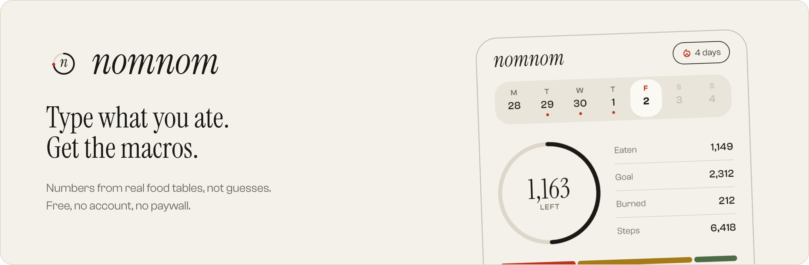
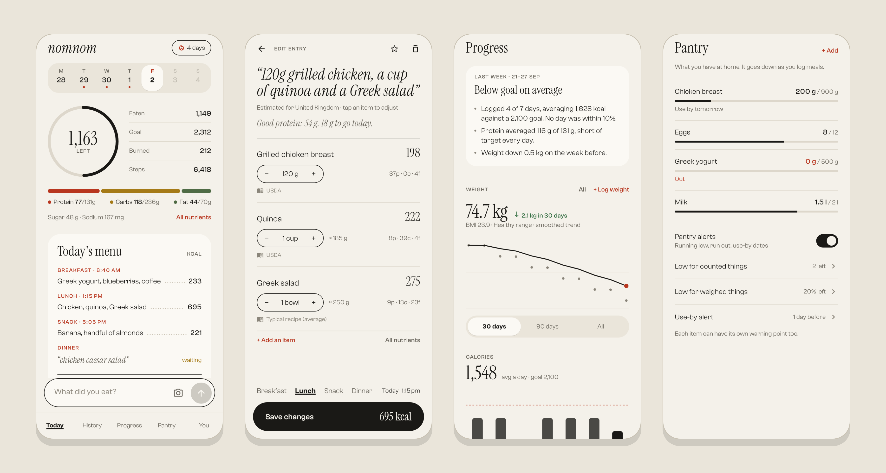

<p align="center">
  
</p>

<p align="center">
  <a href="https://github.com/BraxtonElmer/nomnom/releases/latest"></a>
  
  <a href="LICENSE"></a>
  <a href="https://ko-fi.com/akariyu"></a>
</p>

<p align="center">
  <a href="https://github.com/BraxtonElmer/nomnom/releases/latest"><picture><source media="(prefers-color-scheme: dark)" srcset="docs/download-dark.svg"></picture></a>
  &nbsp;
  <a href="https://ko-fi.com/akariyu"><picture><source media="(prefers-color-scheme: dark)" srcset="docs/kofi-dark.svg"></picture></a>
</p>

## Why I built this

I'm into nutrition, diet and exercise, and I wanted one app that brings the
useful parts together: food logging, macros, weight, goals, what's in the
kitchen. The good ones are mostly behind a paywall, and the free ones make you
search a database for every ingredient. So I built nomnom to be free and
usable by anyone: type what you ate the way you'd say it, and get numbers you
can trust. No account, no subscription, no server.

## What it does

- **Type it like you'd say it.** "120g grilled chicken, a cup of quinoa and a
  Greek salad" becomes items, grams, calories, protein, carbs and fat. Grams, pieces,
  cups, bowls, plates, or a photo of the plate.
- **Real numbers, not guesses.** The AI only reads your sentence. Calories come
  from USDA FoodData Central, tables of about 300 dishes across 16 cuisines,
  and Open Food Facts for branded products. Every item shows its source, and
  anything uncertain is flagged or asked about instead of guessed.
- **Free, with your own key.** It uses a free Groq or Gemini key, or a model
  running on your own computer. Simple meals like "2 boiled eggs and a banana" are read on
  the phone with no AI at all.
- **Learns your real maintenance.** After a few weeks of logging and weighing
  in, it works out what you actually burn and suggests a better target.
  Nothing changes until you accept.
- **Everything in one place.** Weight trend and BMI, micronutrients, a weekly
  recap, meal reminders you can reply to, steps from Health Connect, a
  home-screen widget, and a dark mode.
- **A pantry that counts down.** Add "10 eggs, 450 g chicken breast" when you
  shop, and it goes down as you log. Cooked weights are worked back to raw, and
  it tells you when something runs low or nears its use-by date.
- **Private.** Your log stays on your phone. Only what you log is sent, and
  only to the AI you chose. Keeps itself up to date, and asks before
  installing anything.

<p align="center">
  
</p>

## Install

Download the APK from the
[latest release](https://github.com/BraxtonElmer/nomnom/releases/latest) and
open it on your phone. Android asks once to allow installs from your browser
or file manager. During setup, paste a free
[Groq key](https://console.groq.com/keys) (the quickest to get) and start
logging. nomnom checks for new versions about once a day and asks before
installing them.

## How it works

```
"grilled chicken and a Greek salad"
        │
        ▼
  AI reads the sentence ──► items, amounts, grams, search terms
        │
        ▼
  bundled food tables ────► nutrition per 100 g (USDA + regional dishes)
        │
        ▼
  app does the maths ─────► totals you can adjust with exact arithmetic
```

The AI is good at understanding language and unreliable at remembering
numbers, so it's only trusted with the first step.

- **USDA FoodData Central, SR Legacy:** about 7,300 generic foods with
  household portion weights.
- **Dish tables by cuisine:** about 300 dishes across Indian, Chinese and
  Indo-Chinese, Japanese, Korean, Thai, Vietnamese, Southeast Asian, Italian,
  European, British, American, Mexican, Latin American, Middle Eastern,
  African and South Asian food. Every table is searched for every user, so
  takeaway from another cuisine matches properly. Values are typical recipes,
  cross-checked against USDA's prepared foods.
- **Open Food Facts:** packaged products, searched when you name a brand
  ("a Quest protein bar").

Home-style dishes are averages and say so. Each has a Light / Typical / Rich
setting for oil and ghee, which nomnom remembers. Foods you confirm are
remembered too, so repeat meals come out the same every time. Weighed and
counted foods land within about 10 kcal of the reference values in
`tool/live/precise_test.dart`.

## AI providers

Pick one during setup, or later under **You → AI model**.

| Provider | Key | Notes |
| --- | --- | --- |
| Groq | Free at [console.groq.com/keys](https://console.groq.com/keys) | Fastest, and the free tier lasts for daily use. Defaults to `llama-3.3-70b-versatile`. |
| Gemini | Free at [aistudio.google.com/apikey](https://aistudio.google.com/apikey) | Defaults to `gemini-3.5-flash-lite`. The free tier can be as low as 20 requests a day per model. |
| Custom | Optional | Any OpenAI-compatible server: Ollama, LM Studio, OpenRouter, vLLM… |

To use a model on your own computer with Ollama, run
`OLLAMA_HOST=0.0.0.0 ollama serve`, choose **Custom** in nomnom and use
`http://<your-computer's-wifi-ip>:11434/v1`. Phone and computer need to be on
the same network.

## Privacy

- Your log, weights, pantry and goals are stored only on the phone.
- API keys stay in the phone's secure storage and are never written to backups.
- Only what you log (text, or a photo you choose to send) goes to the AI
  provider you picked. The weekly recap sends summary numbers and food names,
  nothing else.

## Build

Needs Flutter 3.44.

```bash
flutter pub get
flutter run
flutter test
```

| Folder | What's in it |
| --- | --- |
| `lib/ai` | Provider clients (OpenAI-compatible, Gemini) and the meal parser. |
| `lib/nutrition` | Food table search, on-phone meal reading, targets, check-in, weekly recap. |
| `lib/data` | Models, the store over Hive, pantry, reminders, updater, key vault. |
| `lib/screens` | Setup, Today, review, History, Progress, Pantry, You. |
| `lib/theme`, `lib/ui` | The Paper design tokens and shared widgets. |
| `assets/data` | `usda.json` and the dish tables by cuisine. |
| `tool` | Data build and check scripts, screenshot harness, live accuracy checks. |

<details>
<summary>More for developers</summary>

Screenshots of every screen, rendered with the real fonts into `build/shots/`,
plus the README images in `docs/`:

```bash
flutter test tool/shots --update-goldens
```

Live checks against a real model (they spend free-tier requests):

```bash
GEMINI_KEY=... flutter test tool/live/precise_test.dart   # weighed inputs with known answers
GEMINI_KEY=... flutter test tool/live/live_test.dart
Q='whole milk|poha' flutter test tool/live/search_probe_test.dart
```

Rebuild the USDA table from the
[SR Legacy CSV download](https://fdc.nal.usda.gov/download-datasets), and
check the dish tables against it:

```bash
python tool/build_usda.py path/to/FoodData_Central_sr_legacy_food_csv_2018-04
python tool/check_dishes.py
```

**Releasing.** Add a `## [x.y.z]` section to `CHANGELOG.md`, set the same
version in `pubspec.yaml`, then push a tag:

```bash
git tag v2.7.1 && git push origin v2.7.1
```

The release workflow checks the version, builds and signs the APK and drafts a
release with the changelog as its notes. Publishing the draft is what makes it
reach users and the in-app updater. Signing uses the `ANDROID_KEYSTORE_BASE64`
and `ANDROID_KEYSTORE_PASSWORD` secrets (key alias `nomnom`). For signed builds
on your own machine, copy `android/key.properties.example` to
`android/key.properties` and point it at the same keystore.

</details>

## Support

nomnom is free. If it helps you, you can buy me a coffee:

<a href="https://ko-fi.com/akariyu"><picture><source media="(prefers-color-scheme: dark)" srcset="docs/kofi-dark.svg"></picture></a>

## Credits

Typography: Clash Grotesk (Indian Type Foundry, Fontshare licence) and
Instrument Serif (SIL Open Font Licence). Nutrition data: USDA FoodData Central
and Open Food Facts (ODbL).

Estimates, not medical advice.

## License

nomnom is free software, licensed under the [GNU General Public License v3.0](LICENSE).
